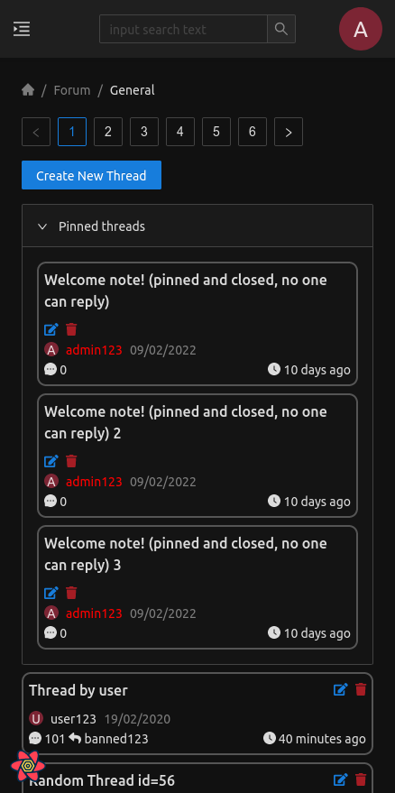

[](https://github.com/lreszczynski/Forum/actions/workflows/java.yml)
[](https://github.com/lreszczynski/Forum/actions/workflows/java.yml)
<a href="https://codeclimate.com/github/lreszczynski/Forum/maintainability"></a>

# Forum<!-- omit in toc -->

## Table of Contents<!-- omit in toc -->

- [Installation, building and running instructions](#installation-building-and-running-instructions)
  - [a) with Docker](#a-with-docker)
    - [Requirements](#requirements)
    - [Build images](#build-images)
    - [Run](#run)
    - [Tests](#tests)
  - [b) without Docker](#b-without-docker)
    - [Requirements](#requirements-1)
    - [Build and run](#build-and-run)
    - [Running tests](#running-tests)
- [Sample images from the application](#sample-images-from-the-application)

Api documentation: https://lreszczynski.github.io/Forum/

# Installation, building and running instructions

## a) with Docker

### Requirements

- `docker` and `docker-compose`

### Build images

```
docker build database-scripts/ --tag dbpostgres && docker build backend/ --tag spring && docker build react-frontend/ --tag react
```

### Run

```
docker-compose up
```

Go to `localhost:3000` in the web browser

### Tests

```
docker build database-scripts/ -f database-scripts/Dockerfile-test --tag dbpostgrestest && docker build . -f backend/Dockerfile-test --tag springtest

docker-compose -f docker-compose-test.yml up \
          --abort-on-container-exit springtest \
          --exit-code-from springtest
```

## b) without Docker

### Requirements

- `java`, `postgres`, `node`

### Build and run

0. Prepare a new Postgres database
1. Create tables with initial data: run
   `./database-scripts/recreate.sh` (modify `USER`, `PASSWORD`, `DATABASE` and `HOST` variables if needed)
2. Change directory to `backend/`
3. Run `./gradlew bootRun` (modify database connection values in `backend/src/main/resources/application.yaml` if needed)
4. Change directory to `react-frontend/` in new terminal session
5. Run `npm start`
6. Go to `localhost:3000` in the web browser

### Running tests

1. Change directory to `backend/`
2. Run `./gradlew test`

# Sample images from the application


